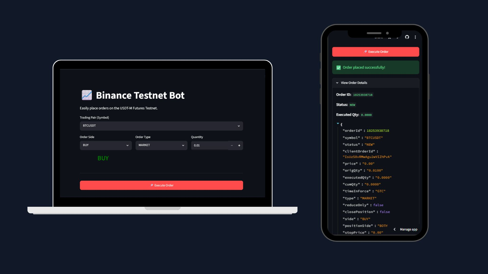

<div align="center">
  
  
  <h1>Binance Futures Testnet Trading Bot</h1>
  <p>A professional, lightweight, and responsive trading bot for the Binance Futures Testnet (USDT-M), featuring both a powerful CLI and a beautiful Web Dashboard.</p>

  [](https://python.org)
  [](https://streamlit.io)
  [](#license)
</div>

<br />

## 🚀 Features

- **Multi-Interface Support:** Control the bot via a lightning-fast Command Line Interface (CLI) or a fully responsive Web UI.
- **Multiple Order Types:** Native support for `MARKET`, `LIMIT`, and `STOP-LIMIT` orders.
- **Smart Time Synchronization:** Automatically offsets local machine timestamps to perfectly match Binance servers, preventing `-1021 Timestamp Ahead` errors.
- **Robust Error Handling & Validation:** Built-in validation for symbols, quantities, and prices before network requests are ever sent.
- **Detailed Logging:** Clean console output paired with rotating file handlers (keeps recent API trace logs without eating up disk space).
- **Secure Configuration:** Credential management handled entirely via `.env` variables. No hardcoded keys.

---

## 🛠️ Project Architecture

This project is designed with modularity in mind, cleanly separating API communication, business logic, and presentation layers.

```text
trading_bot/
├── app.py                 # Streamlit Web UI Entry Point
├── cli.py                 # Command-Line Entry Point (argparse)
├── bot/                   # Core Logic Module
│   ├── client.py          # Binance REST HTTP wrapper & HMAC SHA-256 signing
│   ├── orders.py          # Execution logic and response formatting
│   ├── validators.py      # Strict input sanitization rules
│   └── logging_config.py  # Centralized logger configuration
├── logs/                  # Auto-generated API trace logs
├── .env.example           # Environment template
└── requirements.txt       # Project dependencies
```

---

## ⚙️ Setup Instructions

### 1. Generate Testnet Credentials
1. Visit the [Binance Futures Testnet](https://testnet.binancefuture.com).
2. Log in (using GitHub/Email) and click **"Start demo trading"**.
3. Click your **Profile Icon** (top right) $\rightarrow$ **API Management**.
4. Generate a **System Generated** key pair. Keep the *API Key* and *Secret Key* handy.

### 2. Clone & Install
```bash
# Clone the repository
git clone https://github.com/TechLearnr4S/Trading-Bot-on-Binance-Futures-Testnet.git
cd Trading-Bot-on-Binance-Futures-Testnet

# Create and activate a virtual environment
python -m venv .venv

# On Windows:
.\.venv\Scripts\activate
# On macOS/Linux:
source .venv/bin/activate

# Install dependencies
pip install -r requirements.txt
```

### 3. Configure Environment
Rename `.env.example` to `.env` (or create a new `.env` file) and paste your credentials:
```env
BINANCE_API_KEY=your_testnet_api_key_here
BINANCE_API_SECRET=your_testnet_api_secret_here
```
> ⚠️ **Note:** `.env` is explicitly ignored by `.gitignore` to prevent accidental credential leaks.

---

## 💻 How to Run: Web Dashboard (Recommended)

The project includes a stunning, mobile-responsive Web UI powered by Streamlit.

```bash
streamlit run app.py
```
*Your browser will automatically open to `http://localhost:8501`.*

<div align="center">
  
  <br/><br/>
  <i>The Web UI automatically adapts its layout for desktop and mobile displays.</i>
</div>

---

## ⌨️ How to Run: Command Line (CLI)

For headless environments or automated scripting, use the powerful CLI. All commands must be run from the project root.

**1. Market Order:**
```bash
python cli.py --symbol BTCUSDT --side BUY --type MARKET --quantity 0.01
```

**2. Limit Order:**
```bash
python cli.py --symbol BTCUSDT --side SELL --type LIMIT --quantity 0.01 --price 50000
```

**3. Stop-Limit Order:**
```bash
python cli.py --symbol BTCUSDT --side SELL --type STOP --quantity 0.01 --price 49000 --stop-price 49500
```

### CLI Arguments Reference

| Argument       | Required            | Description                                         |
|----------------|---------------------|-----------------------------------------------------|
| `--symbol`     | **Yes**             | Trading pair symbol (e.g. `BTCUSDT`, `ETHUSDT`)     |
| `--side`       | **Yes**             | Order direction: `BUY` or `SELL`                    |
| `--type`       | **Yes**             | Order type: `MARKET`, `LIMIT`, or `STOP`            |
| `--quantity`   | **Yes**             | Order size in base asset units (e.g., `0.01` BTC)   |
| `--price`      | For LIMIT & STOP    | Limit execution price (USDT)                        |
| `--stop-price` | For STOP only       | Trigger price for the stop condition (USDT)         |

---

## 🔍 Assumptions & Limitations

1. **Testnet Only:** Hardcoded to `https://testnet.binancefuture.com`. Do not use these exact endpoints for production/live trading.
2. **USDT-M Futures:** Only USDT-Margined perpetual contracts are supported (symbols must end in `USDT`).
3. **Quantity Precision:** Binance enforces specific precision/step-sizes for quantities and prices per asset. If you provide an overly precise number (e.g., `0.012345`), the exchange may reject the order.
4. **Time in Force:** All limit and stop orders default to `GTC` (Good Till Canceled).

---

## 📝 Logging System

API request/response payloads and critical errors are automatically persisted to `logs/trading_bot.log`. 
- **Console Output:** Restricted to `WARNING` and above (keeps your terminal clean).
- **File Output:** Logs down to `DEBUG` level (includes full JSON payloads).
- **Rotation:** Automatically rotates logs at 5MB, retaining the last 3 archives.

---

<div align="center">
  <i>Built with ❤️ using Python and Streamlit.</i>
</div>
